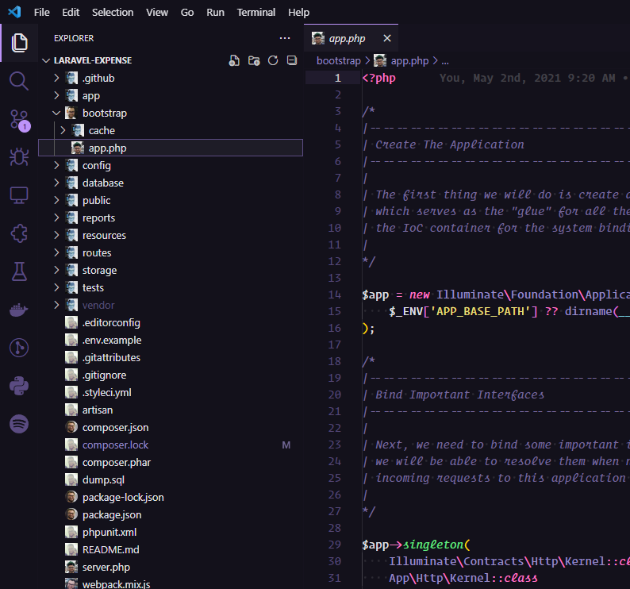

# Dr. Reinão Icons

## Installation

To install and to get the powerful of this extension, just run the following command:

```sh
ext install drreinao-icons
```

## Usage
* `Linux` & `Windows` > **File > Preferences > File Icon Theme > Dr. Reinão Icons**.
* `MacOS` > **Code > Preferences > File Icon Theme > Dr. Reinão Icons**.

## Example


